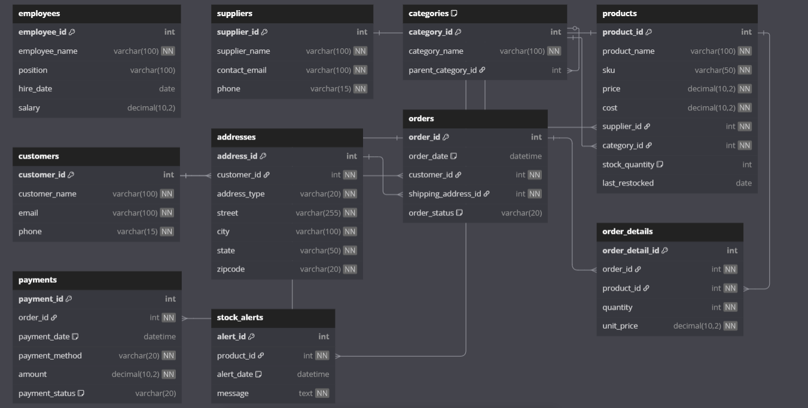

---

# Inventory Management System

## 📦 Overview

The **Inventory Management System** is a robust MySQL-based solution designed to track products, suppliers, orders, customers, payments, shipping, returns, and stock levels for any business that manages inventory. It enforces data integrity, automates business logic, and supports efficient reporting for operations and finance.

---

## 🚀 Features

- **Employee, Supplier, and Customer Management**
- **Product Categorization and Stock Tracking**
- **Order Processing with Detailed Order Lines**
- **Automated Stock Updates and Low Stock Alerts**
- **Integrated Payment and Invoice Handling**
- **Shipping and Returns Management**
- **Normalized Address Storage**
- **Comprehensive Sales Reporting View**
- **Business Logic via Triggers and Procedures**

---

## 🗄️ Database Schema

### Main Entities

- **Employees:** Staff managing inventory
- **Suppliers:** Product vendors
- **Categories:** Product classification
- **Products:** Inventory items
- **Customers:** Buyers
- **Addresses:** Normalized customer addresses
- **Orders:** Customer purchases
- **OrderDetails:** Line items per order
- **Payments:** Order payments
- **StockAlerts:** Automated low-stock notifications

### Key Relationships

- **Customers** `1:N` **Addresses**
- **Customers** `1:N` **Orders**
- **Orders** `1:N` **OrderDetails**
- **Products** `1:N` **OrderDetails**
- **Suppliers** `1:N` **Products**
- **Categories** `1:N` **Products**
- **Orders** `1:1` **Payments**

---

## 🖼️ Entity Relationship Diagram (ERD)

> ! 
> **

---

## ⚙️ Setup & Installation

### Requirements

- MySQL Server 5.7+ (or MariaDB 10+)
- MySQL client or compatible GUI (e.g., MySQL Workbench, DBeaver)

### Steps

1. **Clone the repository:**
   ```bash
   git clone https://github.com/your-username/inventory-management-system.git
   cd inventory-management-system
   ```

2. **Import the SQL schema:**
   ```bash
   mysql -u your_username -p < inventory_system.sql
   ```

3. **(Optional) Review and modify sample data as needed.**

---

## 🛠️ Usage

- **Place Orders:** Use the provided stored procedure `PlaceOrder` for atomic order creation.
- **Monitor Stock:** Triggers automatically update stock and alert when low.
- **View Sales:** Query the `SalesSummary` view for order and payment analytics.
- **Manage Returns:** Track returns via the `Returns` table.
- **Extend:** Add more categories, suppliers, or business logic as needed.

---

## 📊 Example Queries

```sql
-- List products low in stock
SELECT ProductName, StockQuantity FROM Products WHERE StockQuantity < 10;

-- Get all orders for a customer
SELECT * FROM Orders WHERE CustomerID = 1;

-- View sales summary
SELECT * FROM SalesSummary;
```

---

## 🧩 Customization

- Add more payment methods by altering the `Payments` table ENUM.
- Expand triggers for more business rules.
- Integrate with front-end applications or reporting tools.

---

## 📝 License

This project is open-source and available under the [MIT License](LICENSE).

---

## 👨‍💻 Author

- [Your Name](https://github.com/your-username)

---

## 🔗 Resources

- [MySQL Documentation](https://dev.mysql.com/doc/)
- [DrawSQL for ERD](https://drawsql.app/)
- [DBeaver Database Tool](https://dbeaver.io/)

---
